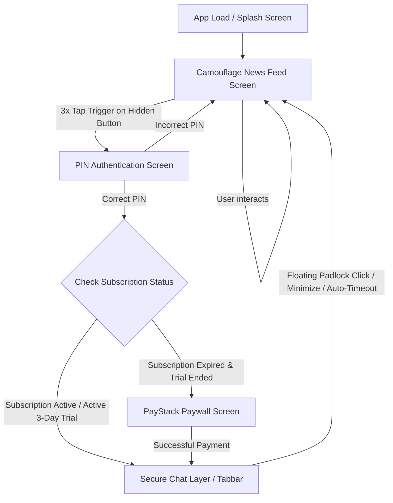
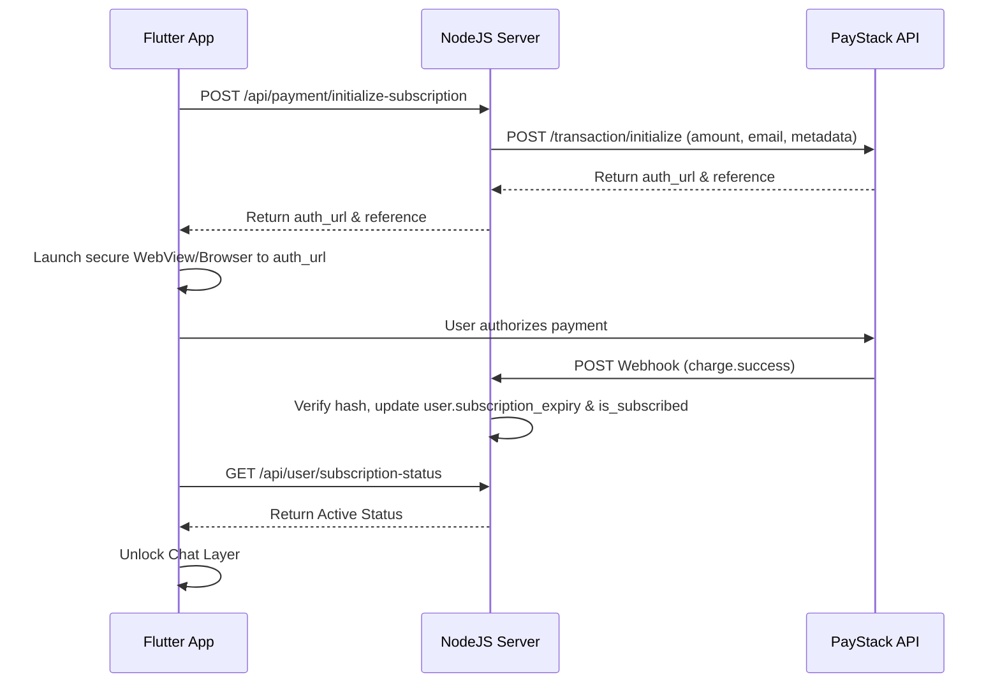

# Project Upgrade Plan: Stealth News & Chat Application Camouflage

This document details the plan of action, technical roadmap, database schema updates, and UI/UX suggestions for upgrading the existing Flutter chat application and its Node.js backend into a high-security, camouflaged stealth application.

---

## 1. Core Architecture Design

The application will operate in two distinct modes: **Camouflage (News) Mode** and **Secure (Chat) Mode**. The transitions between these states will be protected by custom gesture triggers, a secure PIN authentication layer, and subscription validation.



---

## 2. Feature-by-Feature Design

### A. The Camouflage News Layer
* **First Screen Experience**: Upon app launch, the application will always route directly to the News Feed. This screen will display real news stories, categories, search functionality, and pull-to-refresh feeds to mimic a standard commercial news application.
* **Hidden Trigger Mechanism**: A target widget (e.g., a specific logo in the AppBar, an "About" page version text, or a subtle news header) will monitor taps.
  * We will wrap the widget with a `GestureDetector` that tracks sequential taps:
    ```dart
    int _tapCount = 0;
    Timer? _tapResetTimer;

    void _handleTriggerTap() {
      _tapCount++;
      _tapResetTimer?.cancel();
      _tapResetTimer = Timer(const Duration(milliseconds: 1500), () {
        _tapCount = 0;
      });

      if (_tapCount >= 3) {
        _tapCount = 0;
        _tapResetTimer?.cancel();
        Navigator.pushNamed(context, AppRoutes.pinAuth);
      }
    }
    ```

### B. Suggested Free News APIs
We recommend using **standard RSS feeds** or a curated feed parser instead of rate-limited commercial REST APIs to guarantee uptime and zero cost:

1. **RSS Feed Aggregator (Recommended)**: 
   * **Source**: BBC News, Reuters, or CNN RSS feeds.
   * **URL**: `http://feeds.bbci.co.uk/news/world/rss.xml`
   * **Pros**: 100% free, no API keys, no rate limits, highly stable, and realistic news content.
   * **Implementation**: Parse XML to JSON directly in Flutter using the `webfeed` package.
2. **The Guardian API**:
   * **URL**: `https://content.guardianapis.com/search`
   * **Pros**: Free developer key, returns structured JSON, simple query parameters.
3. **NewsAPI.org / GNews.io**:
   * **Pros**: Comprehensive articles search.
   * **Cons**: Free plans block production use (only allow localhost/development requests or have very low limits like 100 requests/day).

---

### C. PIN Code Authentication Screen
* **Security Middleware**: A dedicated PIN entry page (`PinAuthScreen`) will intercept transitions between the News Layer and the Chat Layer.
* **Storage**: Store the hashed PIN code using the existing `SecureStorage` setup to prevent tampering.
* **Auto-Lock Rules**:
  * An AppLifecycleObserver will monitor state changes. If the app is minimized (backgrounded) or inactive for more than a configured duration (e.g., 2 minutes), it instantly resets the authentication state and redirects to the News screen.

---

## 3. Subscription Paywall & PayStack Integration
* **3-Day Trial Period**:
  * Upon account creation, the server automatically initializes a 3-day trial period (`trial_start_date` = current date, `is_trial_active` = true).
* **PayStack Workflow**:
  * PayStack is highly performant and widely supported for cards, bank transfers, and mobile money.
  * **Frontend**: Integrate `flutter_paystack` or implement a direct webhook-driven webview redirect. The client requests a transaction initialization from the backend, then launches the authorization URL.
  * **Backend**: Provide routes to initialize transaction and handle secure webhooks.



---

## 4. Notification Camouflage
To prevent push notifications from leaking the application's true nature, all notifications will be obfuscated at the source.

* **Backend Modification (`src/service/common/oneSignal.service.js`)**:
  * We will add an interceptor inside `sendPushNotification` to modify the visible text of chat messages:
    ```javascript
    // Predefined list of news headlines for camouflage
    const CAMOUFLAGE_HEADLINES = [
      "Market Updates: Index closes at record high amid positive trade outlook.",
      "Global Summit: Leaders pledge actions on carbon emissions.",
      "Tech Insider: Breakthrough in silicon design promises double battery life.",
      "Sports Review: Underdogs clinch victory in dramatic final match.",
      "Science Alert: New planet discovered in habitable zone of nearby star.",
    ];

    async function sendPushNotification({ playerIds, title, message, large_icon, big_picture, data = {}, ...options }) {
      // If notification is not a call (regular chat message), camouflage it
      if (data.message_type && data.message_type !== "call") {
        const randomIndex = Math.floor(Math.random() * CAMOUFLAGE_HEADLINES.length);
        const headline = CAMOUFLAGE_HEADLINES[randomIndex];

        // Store actual metadata inside data block (encrypted or raw)
        data.decrypted_title = title;
        data.decrypted_message = message;
        data.is_camouflaged = true;

        // Replace visible payload with fake news
        title = "Breaking News Alert";
        message = headline;
        
        // Remove media/large icons that would give away user profile pictures
        large_icon = undefined;
        big_picture = undefined;
      }
      
      // Proceed to send standard OneSignal payload...
    }
    ```
* **Frontend Handling (`OneSignalService`)**:
  * Since the visible payload is fake news, if the app is in the **foreground**, we prevent the notification from displaying and trigger local websocket updates.
  * If in the **background** or **closed**, the OS displays the news headline. When clicked:
    1. The app launches directly into the News Feed.
    2. A background check reads `data.is_camouflaged`.
    3. The app routes the user to the PIN Screen.
    4. Upon successful PIN entry, the app directly opens the target `chatId` extracted from the payload `data`.

---

## 5. Floating Padlock (Panic Button)
* **Design**: A subtle, semi-transparent floating action button (FAB) or global overlay widget.
* **Function**: 
  * Instantly clears the in-memory chat session key.
  * Clears navigation history stack (`pushNamedAndRemoveUntil`).
  * Routes back to the News Feed immediately with a smooth fade animation.
  * Triggered by a tap on the padlock or by a shake gesture (optional panic shortcut).

---

## 6. Database Schema Updates (NodeJS Server)

To support trial periods, secure PINs, and PayStack subscriptions, the `User` model requires the following fields:

```javascript
// Sequelize model additions in models/user.js or migrations
module.exports = {
  up: async (queryInterface, Sequelize) => {
    await queryInterface.addColumn('Users', 'stealth_pin_hash', {
      type: Sequelize.STRING,
      allowNull: true,
    });
    await queryInterface.addColumn('Users', 'trial_start_date', {
      type: Sequelize.DATE,
      defaultValue: Sequelize.fn('NOW'),
    });
    await queryInterface.addColumn('Users', 'is_trial_active', {
      type: Sequelize.BOOLEAN,
      defaultValue: true,
    });
    await queryInterface.addColumn('Users', 'is_subscribed', {
      type: Sequelize.BOOLEAN,
      defaultValue: false,
    });
    await queryInterface.addColumn('Users', 'subscription_expiry', {
      type: Sequelize.DATE,
      allowNull: true,
    });
  }
};
```

---

## 7. Implementation Roadmap

### Phase 1: Database & Backend Core Updates
1. Apply migrations to update the database schema.
2. Modify `src/service/common/oneSignal.service.js` to implement notification obfuscation.
3. Implement `src/routes/payment.routes.js` and `src/controller/payment_controller/paystack.controller.js` for PayStack transaction initialization and webhooks.

### Phase 2: Flutter Navigation & Trigger Layer
1. Add new routes in [app_routes.dart](file:///c:/apps/CheetaNews/app/lib/utils/preference_key/constant/app_routes.dart):
   * `/news_feed` (The Camouflage Screen)
   * `/pin_auth` (The PIN Screen)
   * `/paywall` (PayStack Paywall Screen)
2. Update the default/initial route logic in [main.dart](file:///c:/apps/CheetaNews/app/lib/main.dart) and [splash_screen.dart](file:///c:/apps/CheetaNews/app/lib/screens/splash_screen.dart) to point to `/news_feed` as the startup route.
3. Add the 3-tap gesture detector to the header/logo of the News Feed screen.

### Phase 3: Premium UI/UX Polish
1. **News Feed Screen**: Develop a beautiful News screen using standard RSS/XML feeds, incorporating glassmorphism layouts, shimmering loading states, and category tabs.
2. **PIN Code Screen**: Create a keyboard entry view with smooth haptic feedback and error shake animations.
3. **Paywall Screen**: Showcase features, display subscription status details, and provide a premium "Activate Premium" card featuring glassmorphism gradients.
4. **Panic Lock Button**: An overlay padlock button with micro-animations that responds instantly.

---

## 8. Verification & Testing Plan

### Automated Testing
* **Backend Unit Tests**: Verify that webhooks correctly update `is_subscribed` and `subscription_expiry` states.
* **Notification Payload Validation**: Send mock payloads and verify that visible headings/contents match fake news alerts, while background payloads carry correct chat variables.

### Manual Testing Protocol
1. Launch app -> Verify News Feed displays authentic articles.
2. Verify notifications arrive showing random news headlines (no chat details leaked).
3. Click notification -> Verify redirect to PIN screen.
4. Tap news title 3 times -> Verify transition to PIN screen.
5. Enter wrong PIN -> Verify shake animation and error.
6. Enter correct PIN (Fresh User) -> Verify entry to Chat layer via 3-day trial.
7. Click Floating Padlock -> Verify instant kickback to News Feed.
8. Manually expire trial in database -> Verify entering PIN redirects immediately to the PayStack paywall screen.
